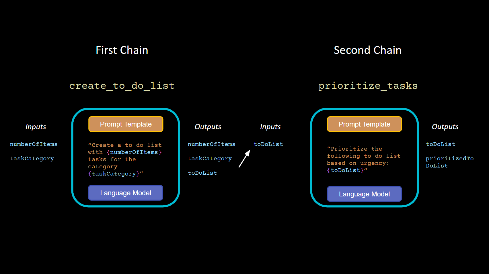

# LangChain Study Notes 
Miguel Munoz 15/12/2023

## Overview
1. Launched in October 2022 as an open-source project by Harrison Chase, now has >70k stars on GitHub
2. LangChain is a framework which helps developers to build applications which use LLMs
3. It does this by providing tools and abstractions that simplify the use of LLMs, handling of data and application of Natural Language Processing (NLP) techniques
4. It provides the ability to use a chain-like structure for sequencing different processing steps which can be used to work with and improve the quality of LLM outputs.

## Core Concepts
1. **Composability**
	- Developers can construct apps by chaining calls to LLMs or other utilities
2. **Chain**
    
	![[./images/LangChainStudyNotes-2ChainExample.png]]    
	- A chain wraps up a Prompt and an LLM call, and is provided with a structured input and can produce a structured output (much like a function) 
	- Chains can be linked together to produce a more complex pipeline. Providing the ability to build re-usable text generation pipelines
3. **Modular Design**
    ![[./images/LangChainStudyNotes-Composability.png]]
	- Makes it easy for developers to plug in different components providing flexibility and the ability to experiment with different models and approaches. 
	- For example it provides a standard interface for working with a many LLMs allowing the developer to select from a variety of LLM providers (OpenAI, Cohere, Hugging Face, etc) and the ability to swap and comparing between them.
4. **Agents**
	- Allows a language model to be used as a 'reasoning engine' to determine which actions to take and in which order

## Benefits
1. **Ease of Use**
	- Abstracts some complex functions, requiring less detailed knowledge of specific underlying LLMs and NLP techniques.
	- Enabling developers to focus on application logic rather than the intricacies of model integration
2. **Rapid Development**
	- Pre-built  features such as Document Loaders, Integration with Vector Databases accelerate development
3. **Community and Support**
	- Open-source frameworks benefit from community contributions and are regularly improved and updated
4. **No Code/Low Code implementations**
	- Flowise and Langflow are tools that provide visual interfaces to quickly develop applications based on LangChain
	- https://flowiseai.com/
	- https://github.com/logspace-ai/langflow
5. **Comprehensive tools**
	- Lots of tools that can be used in  projects without necessarily incorporating the use of prompt templates and chains
6. **Part of an Ecosystem**
	- A broader ecosystem of tools can be leveraged to help productionize systems and provide further features. More details below, but the same creators of LangChain also provide other products such as LangServ and LangSmith
	- https://github.com/langchain-ai
7. **Data Privacy and Security**
	- Can be used in private hosting solutions like Azure OpenAI when data confidentiality is critical
8. **Educational Tool**
	- Provides a learning platform for developers looking to get into LLM Applications
 
## Weaknesses
1. **Dependency on external LLMs**
	- Changes in LLM models or model limitations may directly affect applications built with LangChain. Although this is mitigated somewhat by ability to switch models
2. **Complexity**
	- May be complex for developers not experienced with LLMs and the specific design patterns that LangChain promotes, hence there may be a large learning curve
3. **Community Criticisms (raised by some users)**
	- Abstractions provided by LangChain add needless layers of complexity
	- Lack of documentation
	- Rapid pace of updates and releases compromise the quality and stability of the library
	- A general sentiment that it's great for prototyping but not suitable for serious production environments. 
		- It may be over-engineered for many practical use cases. 
		- Note: In October 2023 LangChain introduced LangServ a deployment tool to transition from prototypes to production-ready apps. 
		- LangSmith a tool for debugging, and monitoring will also be released soon.

## Main Components
1. **Prompt Templates**
	- Provides a structured way of working with and re-using prompts avoiding hard coding of context and queries
	- Essentially you can create a prompt template which accepts *input_variables* and produces a prompt
2. **Chains**
	- The simplest chain takes parameters for a PromptTemplate and executed the prompt on a LLM producing a structured output
	- The output of one chain (essentially can be thought of as a function) can be used as the input to another via SimpleSequentialChain
	- Each chain can use different prompts, different parameters and different models depending on the use case
3. **Indexes**
	- In LangChain terminology this encompasses all external data sources
	- Document loaders
		- Allows for easy importation of documents from
			- Storage services (like Dropbox, Google Drive)
			- Web content like YouTube, PubMed or specific URLs
			- Collaboration tools like Airtable, Trello, Figma, Obsidian
			- Databases like Pandas, MongoDB, MS SQL Server
	- Vector Databases
		- Used to store and retrieve vector representations of text
		- Ability to connect to over 50 different vector stores including Chroma, Pinecone etc.
	- Text Splitters
		- Functions that allow splitting of large text documents into smaller pieces with semantically meaningful chunks that can then be combined using different methods and parameters.
	- Retrievers
		- Retrieval Augmented Generation (RAG) - Facilitates the merging of relevant documents with LLM allowing for the querying stored documents. Accepts a string query as an input and returns a list of Documents as output.
4. **Memory**
	- Tools for adding memory to a system, with options ranging from retaining the entirety of all conversations to retaining a summarization of the conversation.
5. **Agents**
![[./images/LangChainStudyNotes-AgentExample.png]]
	- Agents can be provided with
		- User Input (prompts and queries providing an objective)
		- Tools that can be leveraged (e.g. Functions that contain APIs)
		- Relevant previously executed steps
	- Agent output will be either the next action(s) to take or the final response to send to the user
	- When the Agent specifies the next action it will provide the tool and the input for that tool to produce the required result, before continuing with the steps
6. **Safety Tools**
	- Offers moderation chains designed to filter out harmful or inappropriate content generated by LLMs
7. **LangChain Expression Language (LCEL)**
	- Announced 1 Aug 2023
	- A new syntax to create chains with composition along with a new interface that supports batch, async, and streaming out of the box.
	- Designed to support putting prototypes in production, with no code change and works well with LangServe and LangSmith

## Common Issues and Solutions
1. **Ethical Guidelines and Safety Standards**
	- LLMs may produce responses containing PII (Personally Identifiable Information) and/or toxic content
		- Solution - Constitutional Principles Implementation
			- A set of predefined constitutional principles helps moderate LLM responses, aiming to eliminate content that could be harmful, offensive, or biased
			- It acts like a filter, aligning responses with these principles, preventing offensive content, and maintaining context relevance and integrity.
		- Solution - Moderation Chain
			- A subsystem designed to review and sanitize LLM outputs, before the output reaches end users, ensuring compliance with content policies.

## Case Studies/Projects
1. **Quivr Application**
	- https://www.quivr.app/
	- A GenAI Second Brain, a personal productivity assistant (RAG), chat with your docs (PDF, CSV, ...) & apps using Langchain, GPT 3.5 / 4 turbo, Private, Anthropic, VertexAI, Ollama, LLMs, that you can share with users.
	- Local & Private alternative to OpenAI GPTs & ChatGPT powered by retrieval-augmented generation
2. **Orion Tools Code Reviewer**
	- https://oriontools.ai/
	- Personal code reviewer powered by LLMs (OpenAI GPT-3.5/4, Llama2, Azure AI) & Embeddings, improve code quality and catch bugs before you break production

## Some Use Cases:

1. **Chatbots**: Create intelligent and interactive chatbot systems
2. **Question-Answering Over Documents**: For analyzing and summarizing large volumes of text or structured data
3. **Workflow Automation**: Automate repetitive and complex tasks within business operations
4. **Document Analysis**: Extract and process valuable information from various document types
5. **Complex AI Applications in Tech-Savvy SMBs**: Small and medium-sized businesses with technical expertise can leverage LangChain for developing specialized AI applications
6. **Custom Integration Needs**: Businesses requiring specific integrations and customizations in their AI solutions can use LangChain for its variety of tools and flexibility
7. **Research and Development**: Companies doing R&D sector can use LangChain for experimental AI projects, proof of concepts and prototyping, benefiting from its ability to integrate various models and tools 

## Ecosystem
![[./images/LangChain-Stack---split---V3.png]]
Overview of LangChain ecosystem from https://blog.langchain.dev/the-new-langchain-architecture-langchain-core-v0-1-langchain-community-and-a-path-to-langchain-v0-1/ 

1. **LangServe**
	- https://github.com/langchain-ai/langserve
	- Helps developers deploy LangChain [runnables and chains](https://python.langchain.com/docs/expression_language/) as a REST API
	- This library is integrated with [FastAPI](https://fastapi.tiangolo.com/) and uses [pydantic](https://docs.pydantic.dev/latest/) for data validation
	- Simplifies deployment to production environments with support for streaming, async support, parallel execution optimization, retries and fallbacks, accessing intermediate results and  input/output schemas
2. **LangSmith**
	- https://www.langchain.com/langsmith
	- Platform for building production-grade LLM application. Debug, test, evaluate, and monitor chains and intelligent agent in production environments
3. **LangChain Templates**
	- https://python.langchain.com/docs/templates/
	- Collection of easy to use, deployable reference architectures with the aim of helping developers to get to production more easily
4. **OpenGPTs**
	- Annnounced 7 Nov 2023 (day after OpenAI Dev Day) and initiated by creators of LangChain framwork.
	- Open-source effort to create a similar experience to OpenAIs GPTs and Assistants API. Builds on LangChain, LangServe and LangSmith.
		- Easier tool definition
		- Usage of other LLMs like Anthropic, Azure, and OSS models (of course, compatibility with OpenAI models as well)
		- Full control of the platform (deploy wherever, use APIs however)

## Competing Tools and Frameworks
1. **OpenAI newly released GPT Assistants**
	- https://platform.openai.com/docs/assistants/how-it-works
	* Essentially provides use of agents that can access tools such as documents and functions.
2. **FlowiseAI** 
	- https://flowiseai.com/
	- Not so much competition but rather can build for you.
	- Open source, drag-and-drop UI for building LLM flows and developing LangChain apps
3. **Auto-GPT**
	- https://autogpt.net/
	- open-source fully autonomous 'agent' which uses OpenAI GPT-4 to achive a natural language goal by breaking down into subtasks and using internet and other tools.     
5. **AgentGPT**
	- https://agentgpt.reworkd.ai/
	- Deploy autonomous AI agents through web browsers. Relies on user inputs and works by interacting with human user to achieve tasks.    
6. **MetaGPT** 
	- https://github.com/geekan/MetaGPT
	- 30k stars on GitHub. Multi-agent framework that is capable of running an entire software development company via Agents. Given one line of requirements can return PRD, Design, Tasks and Repo.
7. **LlamaIndex**
	- https://www.llamaindex.ai/
	- Specializes in intelligent search and data indexing and retrieval. A framework to help you build LLM apps. Offers data connectors, ways to structure data, advanced retrieval/query interface and integration (e.g. with LangChain, Flask, Docker, ChatGPT).

## Additional Resources
1. **Documentation**
	- https://python.langchain.com/docs/get_started/introduction
2. **Tutorials**
	- https://python.langchain.com/docs/additional_resources/tutorials
3. **Community Forums**
	- https://github.com/langchain-ai/langchain/discussions
4. **Community Participation**
	- https://python.langchain.com/docs/community
